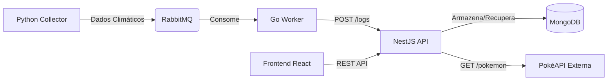

# Sistema de Clima Full-Stack (Desafio GDASH)

Uma aplicação full-stack moderna que coleta dados climáticos, processa em microsserviços e visualiza em um dashboard interativo.

## 🏗 Arquitetura

O sistema segue uma arquitetura orientada a microsserviços:

1.  **Python Collector**: Busca dados climáticos da API Open-Meteo a cada minuto e publica no RabbitMQ.
2.  **RabbitMQ**: Broker de mensagens para desacoplar o coletor do worker.
3.  **Go Worker**: Consome mensagens do RabbitMQ, valida os dados e envia para a API NestJS.
4.  **NestJS API**: API REST que armazena dados no MongoDB, gerencia usuários, autenticação e gera insights.
5.  **MongoDB**: Banco de dados NoSQL para armazenar logs climáticos e usuários.
6.  **Frontend (React)**: Dashboard para visualização de dados, gerenciamento de usuários e exploração de APIs externas.

## 🚀 Como Rodar

### Pré-requisitos
- Docker e Docker Compose instalados.

### Passos
1.  Clone o repositório (ou navegue até a pasta do projeto).
2.  Execute o comando abaixo para subir todo o ambiente:

```bash
docker compose up -d --build
```

3.  Aguarde alguns instantes para que todos os serviços iniciem.

## 🌐 Acessando a Aplicação

- **Frontend Dashboard**: [http://localhost](http://localhost)
- **Documentação da API (Swagger)**: [http://localhost:3000/api](http://localhost:3000/api)
- **Gerenciamento RabbitMQ**: [http://localhost:15672](http://localhost:15672) (usuário: `guest` / senha: `guest`)

## 🔑 Credenciais Padrão

**Usuário Admin:**
- **Email**: `admin@example.com`
- **Senha**: `123456`

## 🛠 Tecnologias e Serviços

- **Python Collector**: Python 3.11, Requests, Pika, Schedule.
- **Go Worker**: Go 1.21, AMQP.
- **NestJS API**: NestJS, Mongoose, Passport, JWT, Swagger, Axios.
- **Frontend**: React, Vite, TailwindCSS, shadcn/ui, Recharts, Axios, Lucide Icons.

## ✨ Funcionalidades Extras (Bônus)

Além dos requisitos principais, foram implementadas as seguintes funcionalidades opcionais:

-   **Integração com API Pública (PokéAPI)**:
    -   Backend (NestJS) consome a PokéAPI com paginação.
    -   Frontend exibe lista de Pokémons na aba "Explore API".
    -   Modal com detalhes (Sprites, Tipos, Peso/Altura).
-   **UI Premium**: Dashboard com Sidebar, Gráficos de Área com degradê e Ícones.

## ✅ Checklist do Desafio

- [x] Serviço Python (Coletor)
- [x] Worker em Go
- [x] API NestJS (Clima, Usuários, Insights)
- [x] Frontend React (Login, Dashboard, Usuários)
- [x] Docker Compose
- [x] Documentação
- [x] **Bônus**: Integração com API Externa (PokéAPI)

## 📐 Diagrama de Arquitetura



---
**Desenvolvido por Gabriel Calebe** 🚀
